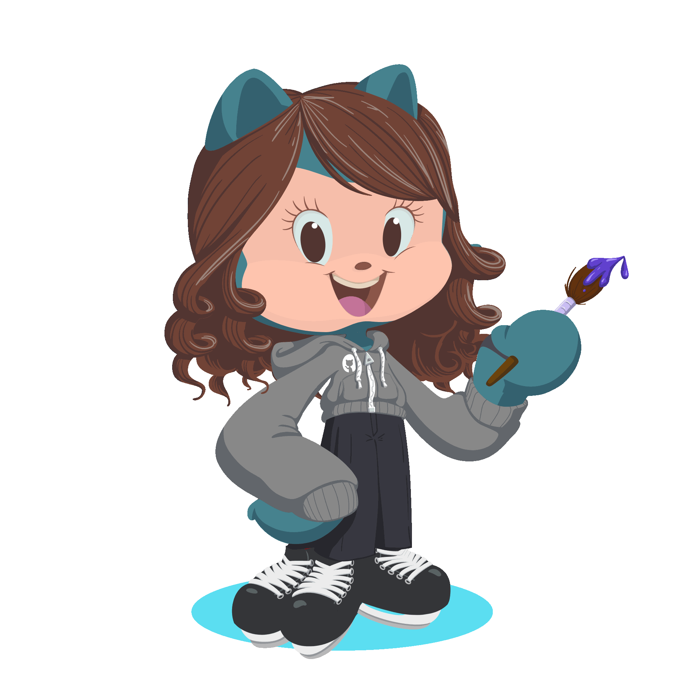

# Oii, eu sou a Isabela! 😏

Sou uma estudante de tecnologia de 18 anos, cursando o 2° semestre de Análise e Desenvolvimento de Sistemas, entusiasta de <strong>UX/UI Design, desenvolvimento de software e programação</strong>.
Apaixonada por <strong>arte e design</strong>, adoro transformar ideias em projetos criativos que combinam lógica e sensibilidade estética para construir experiências digitais envolventes.
Estou sempre em busca de aprender novas tecnologias e aprimorar minhas habilidades, com o objetivo de desenvolver soluções de alta qualidade que unam <strong>estética e tecnologia</strong>.

<table>
  <tr>
    <td>
      

   • 🧠 Desenvolvedora em formação.  
   • 💭 Muito interresada em UX/UI e front.  
   • 🌍 Sempre aprendendo coisas novas.   
         
   
   
    
      

    </td>
    <td>
      
    </td>
  </tr>
</table>

   • 🧠 Desenvolvedora em formação.  
   • 💭 Muito interresada em UX/UI e front. 
   • 🌍 Sempre aprendendo coisas novas.

 

  

 
  
  
   

---

  
  

 
  
  
  
  

---

<picture align="center">
  <source media="(prefers-color-scheme: dark)" srcset="https://raw.githubusercontent.com/IsabelaAmasu/IsabelaAmasu/output/github-contribution-grid-snake-dark.svg">
  <source media="(prefers-color-scheme: light)" srcset="https://raw.githubusercontent.com/IsabelaAmasu/IsabelaAmasu/output/github-contribution-grid-snake-dark.svg">
  
</picture>
