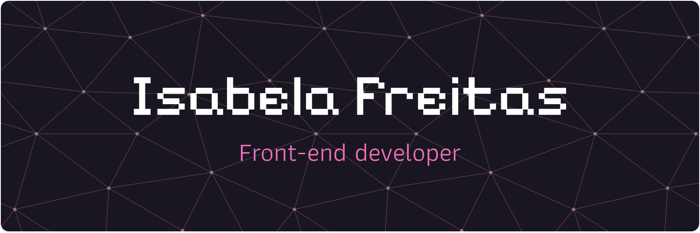

  

  

Estudante de ADS 💻 | UX/UI • Programação • Design 🎨

Sou estudante de ADS (3º semestre) e entusiasta de <strong>UX/UI Design, programação e desenvolvimento de software</strong>.
Apaixonada por <strong>arte e design</strong>, gosto de transformar ideias em projetos criativos que unem <strong>estética e tecnologia</strong>.
Estou sempre em busca de aprender mais e evoluir minhas habilidades.

 

 
  
  
   

 

<h1 align="center">GitHub Stats ✨</h1>
 

  
  

 

<h1 align="center">Tech Stack 🚀</h1>
 

  
  
  
  
  
  
  
  
  
  
  

 

<picture align="center">
  <source media="(prefers-color-scheme: dark)" srcset="https://raw.githubusercontent.com/IsabelaAmasu/IsabelaAmasu/output/github-contribution-grid-snake-dark.svg">
  <source media="(prefers-color-scheme: light)" srcset="https://raw.githubusercontent.com/IsabelaAmasu/IsabelaAmasu/output/github-contribution-grid-snake-dark.svg">
  
</picture>
